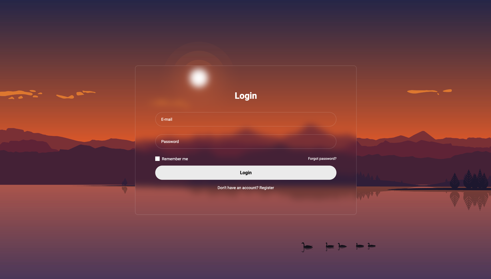

# Проект [SimpleForm](https://github.com/AlexFromNorth/SimpleForm) | Frontend / Firebase

### 📜 Описание:
Простая форма авторизации на `React.js`. Имеет заглушку(#) на fetch запросе и приятный дизайн на css. Без готовых компонентов от css фреймворков.


### 🥞 Стек:

`HTML5` `CSS3`  `React` `БЭМ (Nested)` `TypeScript`

### 💽 Установка и запуск:

1. Склонировать репозиторий в текущую папку:

```git clone https://github.com/AlexFromNorth/SimpleForm.git ```

2. Установить зависимости:

```yarn install```

3. Запустить проект в режиме разработки:

```yarn start```

<br />
<br />


